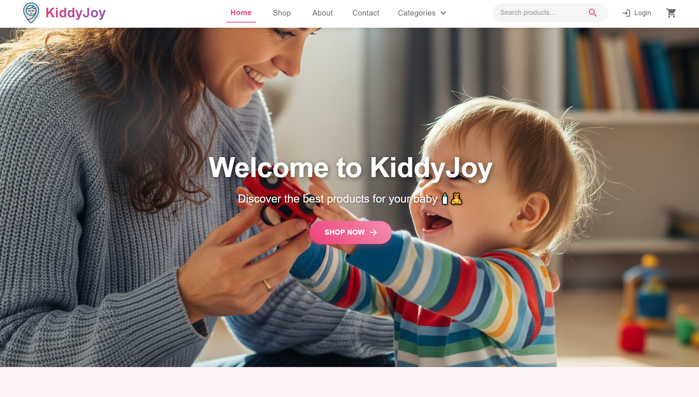
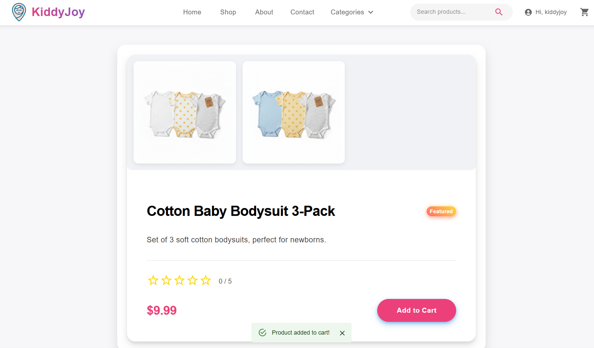
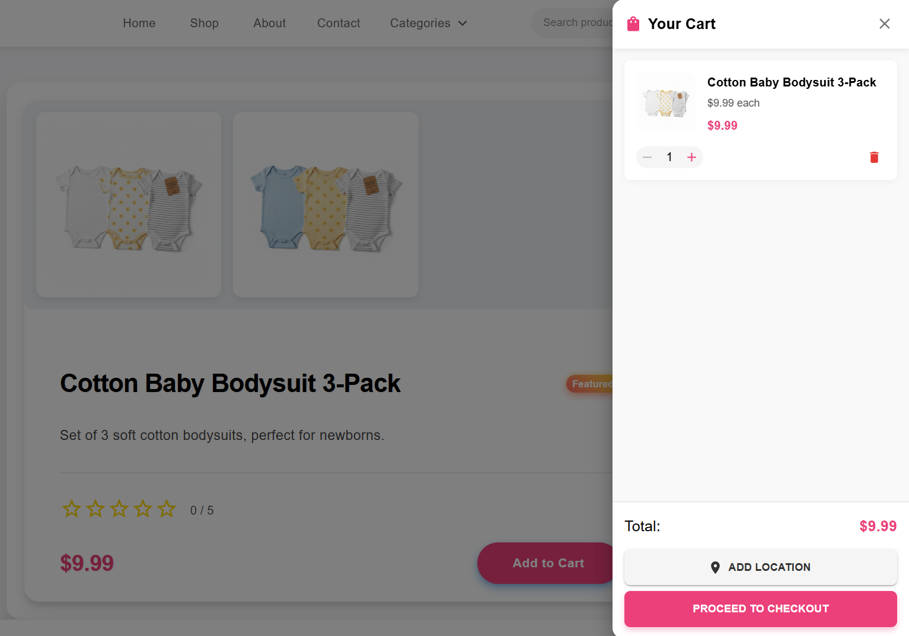
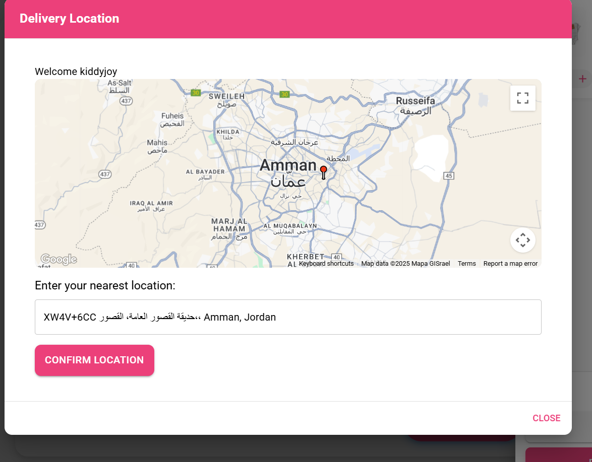
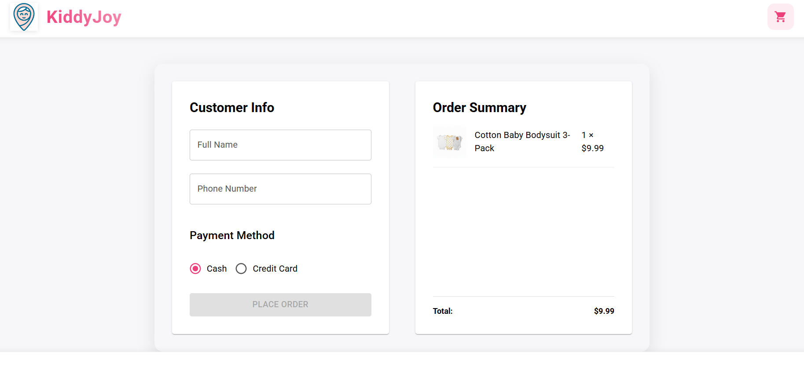
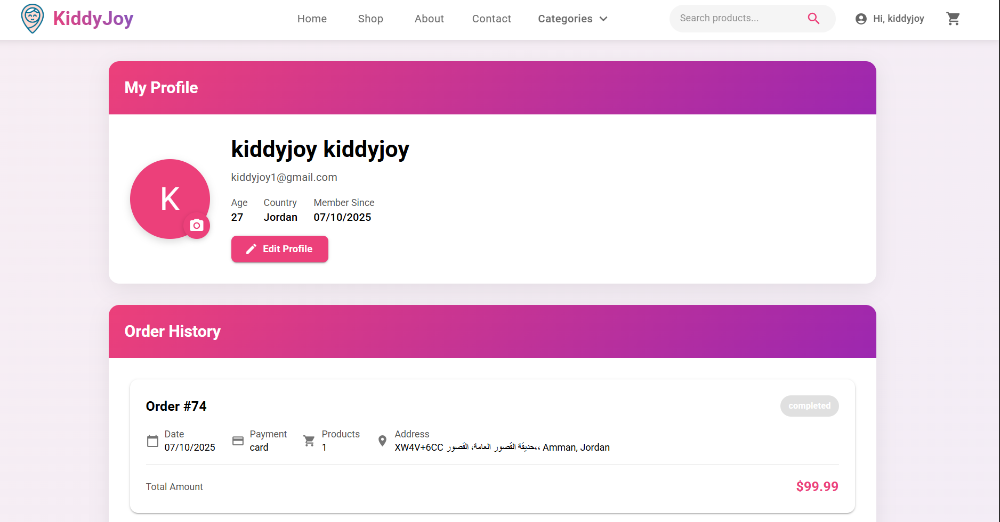
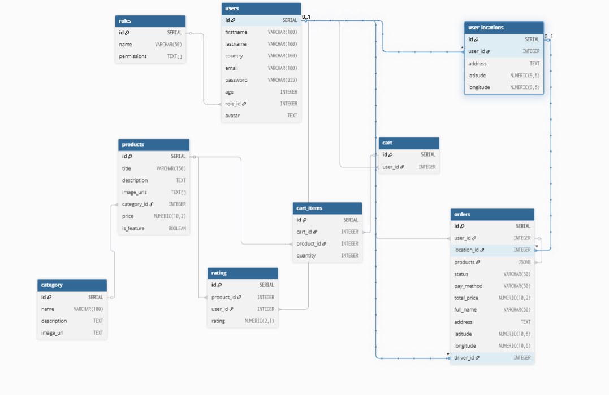

<p align="center">
  
</p>

<h3 align="center">TECHNEST
</h3>

---

<p align="center"> An awesome Project to describe README 
    <br> 
<a href='https://kiddyjoy.vercel.app/'>Demo</a>
    <br> 
</p>

## 📝 Table of Contents

- [About](#about)
- [Getting Started](#getting_started)
- [Usage](#usage)
- [Built Using](#built_using)
- [User Story](#user_story)
- [Data Flow](#data_flow)
- [Guided By](#guided_by)

## 🧐 About <a name="about"></a>

Welcome to **KiddyJoy**, your trusted destination for magical and safe children’s products. We are dedicated to providing high-quality toys, games, and baby gear, along with exceptional service, to bring joy, learning, and fun to every child’s life.

From educational toys and playful games to baby essentials, we carefully select every product to ensure it meets parents’ expectations. Whether you’re a parent, guardian, or gift-giver, **KiddyJoy** has the perfect solution to spark imagination and happiness for your little ones.

---

## 🏁 Getting Started <a name = "getting_started"></a>

### Prerequisites

- [Visual Studio Code](https://code.visualstudio.com/)  
- [Git](https://git-scm.com/)  
- [Node.js](https://nodejs.org/)  

### Installing:

1. Clone the repo to your local machine using git bash.

```
git clone https://github.com/binary-beasts5/MERAKI_Academy_Project_5.git
```

2. Install packeges repeat this step in backend and frontend folder

```
npm i
```

3. Run server using git bash inside backend folder

```
npm run dev
```

4. Run application using git bash inside frontend folder(vite)

```
npm run dev
```

Now app ready to use

## 🎈 Usage <a name="usage"></a>

KiddyJoy web app is easy and intuitive to use. Here’s how you can get started:

1. **Browse without logging in:**  
   You can explore the web app and view products without creating an account.  
   

2. **Create an account, log in, and add to cart:**  

| Product Page | After Adding to Cart |
|--------------|--------------------|
|  |  |

3. **Select your location before checkout:**  
   To complete your purchase, you must select your delivery location on the checkout page.  
   

4. **Complete your purchase:**  
   After selecting the location, you can checkout and pay either by cash or card.  
   

5. **View your orders:**  
   Access your profile page to see all your orders and track their status.  
   
## ⛏️ Built Using <a name="built_using"></a>

### Frontend


### Backend


### Data


---
## User Story <a name = "#user_story"></a>

Your trello board link
<a href='https://trello.com/b/dI45KtUq/binary-beasts'>Trello</a>

## Data Flow <a name = "#data_flow"></a>

</a>

## ⚠️ Guided By <a name = "guided_by"></a>

This project is guided by ©️  **[MERAKI Academy](https://www.meraki-academy.org)**
